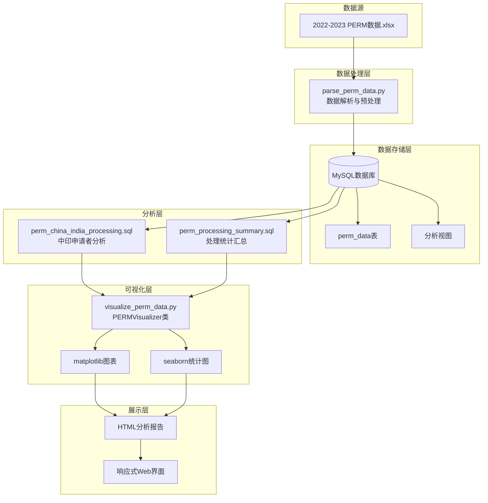

# 📊 PERM 数据分析与可视化平台

<div align="center">


**基于美国劳工部2022-2023年度PERM申请数据的数据分析与可视化平台**

[📖 查看报告](2022-2023年度美国劳工部PERM申请数据分析报告.html) •
[🚀 快速开始](#快速开始) • [📋 功能特性](#功能特性) • [🎯 数据洞察](#数据洞察)

</div>

---

## 📋 目录

- [🎯 项目简介](#项目简介)
- [✨ 功能特性](#功能特性)
- [🏗️ 系统架构](#系统架构)
- [🚀 快速开始](#快速开始)
- [📁 项目结构](#项目结构)
- [🛠️ 技术栈](#技术栈)
- [📊 数据洞察](#数据洞察)
- [🎨 可视化示例](#可视化示例)
- [🤝 贡献指南](#贡献指南)
- [📄 许可证](#许可证)

---

## 🎯 项目简介

**PERM（Program Electronic Review
Management）**是美国劳工部对劳工证的电子评估管理体系。本项目基于2022-2023年度美国劳工部官方PERM申请统计数据，构建了一个完整的数据分析平台，包括数据解析、存储处理和可视化分析等功能。

### 核心目标

- 🔍 **数据解析**：自动化解析Excel数据源，进行数据清洗和标准化
- 💾 **数据存储**：建立高效的MySQL数据库存储方案
- 📈 **数据可视化**：生成多维度可视化图表，揭示数据趋势
- 🌍 **跨文化分析**：重点关注中国和印度申请者的数据对比分析
- 📊 **统计分析**：提供深度的统计数据洞察

---

## ✨ 功能特性

### 🔄 数据处理流程


### 🎯 核心模块

| 模块           | 功能描述                          | 关键技术               |
| -------------- | --------------------------------- | ---------------------- |
| **数据解析**   | Excel文件读取、数据清洗、去重处理 | pandas, openpyxl       |
| **数据存储**   | 批量插入MySQL、表结构管理         | mysql-connector-python |
| **分析视图**   | 多维度数据视图、统计聚合          | SQL Views              |
| **数据可视化** | 图表生成、报告导出                | matplotlib, seaborn    |
| **报告展示**   | 交互式HTML报告、响应式设计        | HTML5, CSS3            |

---

## 🏗️ 系统架构



---

## 🚀 快速开始

### 📋 环境要求

- **Python**: 3.8+
- **MySQL**: 8.0+
- **操作系统**: Windows/Linux/macOS

### 🔧 安装步骤

1. **克隆项目**
   ```bash
   git clone https://github.com/your-username/perm_data_Analytics-and-visualization.git
   cd perm_data_Analytics-and-visualization
   ```

2. **安装Python依赖**
   ```bash
   pip install pandas openpyxl mysql-connector-python matplotlib seaborn
   ```

3. **数据库配置**
   ```bash
   # 创建MySQL数据库
   mysql -u root -p
   CREATE DATABASE perm_analysis;
   ```

### 🎮 使用流程

1. **创建数据库表结构**
   ```bash
   mysql -u root -p perm_analysis < create_perm_table.sql
   ```

2. **导入数据到数据库**
   ```bash
   python parse_perm_data.py
   ```

3. **创建分析视图**
   ```bash
   mysql -u root -p perm_analysis < perm_china_india_processing.sql
   mysql -u root -p perm_analysis < perm_processing_summary.sql
   ```

4. **生成可视化报告**
   ```bash
   python visualize_perm_data.py
   ```

5. **查看分析报告** 打开 `2022-2023年度美国劳工部PERM申请数据分析报告.html`

---

## 📁 项目结构

```
perm_data_Analytics-and-visualization/
├── 📄 README.md                          # 项目说明文档
├── 📄 2022-2023年度美国劳工部PERM申请数据分析报告.html  # 分析报告页面
├── 📄 2022-2023年度美国劳工部PERM申请数据分析报告.md   # 分析报告markdown
│
├── 🔧 数据处理模块/
│   ├── 📄 parse_perm_data.py             # 数据解析与导入脚本
│   └── 📄 visualize_perm_data.py         # 数据可视化脚本
│
├── 🗄️ 数据库脚本/
│   ├── 📄 create_perm_table.sql          # 数据库表结构创建
│   ├── 📄 perm_china_india_processing.sql  # 中印申请者分析视图
│   └── 📄 perm_processing_summary.sql    # 处理统计汇总视图
│
├── 📊 原始数据/
│   └── 📄 2022-2023年度美国劳工部PERM申请数据.xlsx  # 原始数据文件
│
└── 📈 输出结果/
    └── 📄 charts/                        # 生成的图表文件
```

---

## 🛠️ 技术栈

### 🐍 后端技术

| 技术                       | 版本 | 用途           |
| -------------------------- | ---- | -------------- |
| **Python**                 | 3.8+ | 主要编程语言   |
| **pandas**                 | 1.3+ | 数据处理和分析 |
| **openpyxl**               | 3.0+ | Excel文件读取  |
| **mysql-connector-python** | 8.0+ | 数据库连接     |

### 🗄️ 数据库技术

| 技术          | 版本 | 用途         |
| ------------- | ---- | ------------ |
| **MySQL**     | 8.0+ | 主数据库     |
| **SQL Views** | -    | 数据分析视图 |

### 📊 可视化技术

| 技术           | 版本  | 用途           |
| -------------- | ----- | -------------- |
| **matplotlib** | 3.5+  | 基础图表绘制   |
| **seaborn**    | 0.11+ | 统计数据可视化 |

### 🎨 前端技术

| 技术           | 版本 | 用途         |
| -------------- | ---- | ------------ |
| **HTML5**      | -    | 报告页面结构 |
| **CSS3**       | -    | 样式和布局   |
| **JavaScript** | ES6+ | 交互功能     |

---

## 📊 数据洞察

### 🎯 关键发现

- **申请趋势**：分析2022-2023年度PERM申请的时间分布和增长趋势
- **地域分析**：各州申请数量分布和热门地区识别
- **行业分布**：不同行业的申请情况和薪资水平对比
- **学历影响**：申请者学历与获批率的关系分析
- **国际对比**：中国和印度申请者的详细对比分析

### 📈 统计指标

| 指标类别       | 具体指标                     |
| -------------- | ---------------------------- |
| **申请统计**   | 总申请数、月度申请量、审批率 |
| **地域分析**   | 各州分布、城市集中度         |
| **薪资分析**   | 平均薪资、薪资区间、行业对比 |
| **时间分析**   | 处理周期、季度趋势、年度对比 |
| **成功率分析** | 整体获批率、按类别细分       |

---

## 🎨 可视化示例

项目生成的可视化图表包括：

- 📊 **柱状图**：各州申请数量对比
- 🥧 **饼图**：申请者学历分布
- 📈 **折线图**：月度申请趋势
- 🔥 **热力图**：地域分布密度
- 📊 **箱线图**：薪资水平分布
- 📈 **散点图**：申请量与薪资关系

---

## 🤝 贡献指南

欢迎对本项目贡献代码和建议！

1. Fork 本仓库
2. 创建特性分支 (`git checkout -b feature/AmazingFeature`)
3. 提交更改 (`git commit -m 'Add some AmazingFeature'`)
4. 推送到分支 (`git push origin feature/AmazingFeature`)
5. 打开 Pull Request

---

## 📄 许可证

本项目采用 MIT 许可证 - 查看 [LICENSE](LICENSE) 文件了解详情。

---

## 📞 联系方式

- **项目链接**:
  [https://github.com/your-username/perm_data_Analytics-and-visualization](https://github.com/your-username/perm_data_Analytics-and-visualization)
- **报告链接**:
  [2022-2023年度美国劳工部PERM申请数据分析报告](2022-2023年度美国劳工部PERM申请数据分析报告.html)

---

<div align="center">

**⭐ 如果这个项目对您有帮助，请给个 Star！**

Made with ❤️ and Python

</div>
